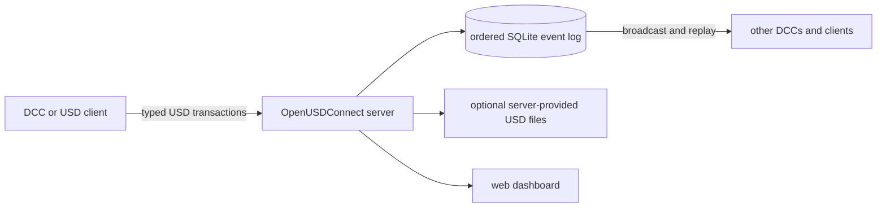

# OpenUSDConnect

OpenUSDConnect synchronizes supported OpenUSD scene changes between connected
applications. For example, when a user moves an imported object in Blender, the
Blender add-on sends that change to a central server. The server records the
change and sends it to another Blender instance, Unreal Engine, or a compatible
Python client.

- Send and receive supported scene edits with Blender, Unreal Engine, and Python
  clients. usdview can receive changes, and MCP clients can inspect or edit the
  server scene.
- Reconnect a client and apply the changes it missed from the server's event
  history.
- Join by opening the original USD file and entering the server address, or by
  opening an optional server-generated USD file that contains that information.
- View connected clients, scene layers, prims, and recent changes in a web
  dashboard.

## Getting Started

The first test runs one temporary server and two Python/OpenUSD clients. It is
headless, bounded, and does not require Blender or Unreal Engine.

Requirements: [Git](https://git-scm.com/), Python 3.13+, and
[uv](https://docs.astral.sh/uv/). The commands below work in PowerShell and
POSIX-compatible shells. If Python 3.13 is not already installed, `uv` can
download a compatible interpreter into its managed cache.

```bash
git clone https://github.com/RoboticHuman/OpenUSDConnect.git
cd OpenUSDConnect
uv sync --group bundled-usd
```

The `bundled-usd` group installs the renderer-neutral `usd-core` runtime. A
project that needs custom resolvers, renderers, file formats, or shader plugins
should use its own OpenUSD installation instead; see
[OpenUSD runtime and custom plugins](docs/cli-reference.md#openusd-runtime-and-custom-plugins).

Run the headless smoke test:

```bash
uv run python examples/usd_native_client/run.py --no-usdview --seconds 3
```

The launcher creates a temporary event log, starts the server and two clients,
and stops them when the test finishes. A successful run reports
`local_valid=True` and `peer_valid=True`.

### Continue With Blender

The Blender tutorial starts a persistent local server, connects two Blender
instances, and verifies an object transform through the dashboard. It requires
Blender 4.4 or newer; Blender supplies its own Python and OpenUSD runtime.

```bash
uv sync --group bundled-usd --group dashboard
uv run python scripts/build_blender_addon.py
```

Install `dist/usd_connect_blender.zip` through **Edit > Preferences > Add-ons >
Install from Disk**, then follow [Getting Started With Blender](docs/getting-started.md).

The base-file workflow is the default: each client opens the same base scene
and connects to the server. As an alternative, the server can provide a
generated `scene.usd` that carries the current scene and connection address for
selection through a file picker. Live updates still use the TCP sync server.
See [Server-Provided USD Files](docs/live-open.md) for that optional path.

## Integrations

| Integration | Direction | Best starting point |
| --- | --- | --- |
| **Blender** | Bidirectional | [Install, base-file connection, and server-provided file](docs/blender-addon-usage.md) |
| **Unreal Engine** | Bidirectional | [Plugin installation and live stage workflow](integrations/unreal/OpenUSDConnect/README.md) |
| **usdview** | Receive | [Launcher and viewer plug-in](integrations/usdview/README.md) |
| **Python / OpenUSD** | Bidirectional | [USD-native integration contract](docs/usd-native-integration.md) |
| **MCP** | Author and inspect | [Connect an MCP client](docs/mcp-server-usage.md) |
| **Dashboard** | Observe and administer | [Getting started](docs/getting-started.md#inspect-the-session) |

Blender and usdview can reconstruct the server's separate collaboration layers.
Blender can also continue from a flattened server-provided file. Unreal uses a
flattened scene state for both direct and server-provided file connections. Each
integration guide describes its setup requirements and current limitations.
Flattened continuation is limited to sessions with one unmuted collaboration
layer and no department policy; see
[server-provided USD files](docs/live-open.md#embedded-metadata).

### Run the cross-application Material Zoo

See the same live material scene in Blender, usdview, and Unreal Engine:

```bash
uv run python scripts/run_material_zoo.py --viewers blender usdview unreal
```

The runner discovers the selected applications, starts a temporary server,
connects each integration, and streams the Material Zoo with a shared camera
and environment light. Select any subset of the three viewers. See the
[testing guide](docs/testing-setup.md#inspect-the-material-zoo-interactively)
for runtime selection and additional options.

`scripts/start_usdview.py` starts a temporary server, discovers the matching
usdview executable, and wires the receiver plugin. Use
`python -m integrations.usdview.launcher` to connect to an existing server.
For MaterialX and RenderMan, add `--renderman`; the launcher configures the
renderer environment and selects hdPrman when a compatible RenderMan/OpenUSD
installation is available.

## How It Works



Each integration converts local edits into typed USD messages. The server stores
those messages in an ordered SQLite event log and sends them to the other
clients. A client that joins late or reconnects requests the changes after the
last event it applied. The network protocol uses length-prefixed FlatBuffers
messages over TCP.

The core library is pure Python on top of `pxr`. Host integrations add the
stage ownership, native scene conversion, event-loop, and lifecycle behavior
required by each application.

| Synchronization mode | Use it for |
| --- | --- |
| `managed` | The default for DCC integrations. Every participant must open an equivalent base scene and resolve its assets compatibly; the server distributes collaboration-layer edits and replay, not the base assets. |
| `shared_stage` | Synchronizing an existing root-and-sublayer graph. Every participant must begin with equivalent authored files and asset-resolution results; see the architecture guide for graph restrictions. |

See the [USD-native integration contract](docs/usd-native-integration.md) and
[shared-stage architecture](docs/shared-stage-architecture.md) before building
a custom integration.

## Feature Coverage

The project implements the following USD data across its core and bundled
integrations. Each integration supports the subset that its host application
can author or display; consult its guide for exact behavior.

- Transforms, visibility, prim lifecycle, typed attributes, primvars, and relationships
- Meshes, curves, points, native scenegraph instances, and point instancers
- UsdPreviewSurface, MaterialX, OpenPBR translation, textures, and material bindings
- References, payloads, variants, list operations, and shared file-layer editing
- Cameras, UsdLux lights and applied APIs, stage units, timelines, and playback
- Time-sampled transforms, attributes, shader inputs, and instancer data
- Custom property and metadata changes through exact Sdf field deltas

The server also provides:

- Managed collaboration layers with department ordering and mute controls
- TOFU authentication, rate limiting, compaction, and reconnect replay

The [documentation hub](docs/README.md) separates user guides, concepts,
reference material, examples, and contributor workflows.

## More Ways To Start

### Animated Instancing Demo

With a discoverable usdview installation:

```bash
uv sync --group bundled-usd
uv run python examples/instancing_dance/run.py
```

### Material Zoo

Stream a material-rich scene into Blender, usdview, or both:

```bash
uv run python scripts/run_material_zoo.py --viewers blender
```

### Docker

```bash
docker compose --profile dashboard up
```

See the [example index](examples/README.md) and
[command-line reference](docs/cli-reference.md) for other workflows.

## Development

The default test suite is headless. Blender, Unreal, asset, slow, and visual
tiers are enabled explicitly as described in the [testing guide](docs/testing-setup.md).

```bash
uv sync --group bundled-usd --group vfs --group mcp --group dev
uv run ruff check .
uv run pytest tests/unit -q
```

## Acknowledgments

- [USD Working Group Assets](https://github.com/usd-wg/assets) supplies the
  optional standardized assets used by integration and visual tests.

Licensed under the [Apache License 2.0](LICENSE).
