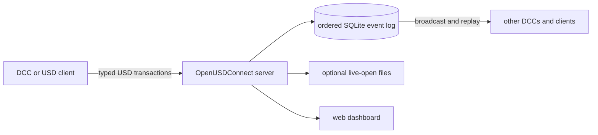

# OpenUSDConnect

Real-time OpenUSD scene synchronization across Blender, Unreal Engine, usdview,
Python applications, and MCP clients.

OpenUSDConnect turns ordinary USD edits into ordered transactions, sequences
them through an authoritative server, and applies the composed result in every
connected application. It synchronizes transforms, geometry, materials,
composition, animation, cameras, lights, instancing, and custom USD data without
making one DCC the center of the workflow.

- Connect multiple applications to one authoritative USD sync server.
- Optionally serve a live scene through a normal file picker with embedded connection metadata.
- Use the bundled integrations or build a host integration on the same Python core.
- Inspect clients, layers, prims, and events from the optional web dashboard.

## Getting Started

Start with the normal managed server and the small `test_scene.usda` included
in the repository.

### 1. Install

Requirements: Python 3.13+, [uv](https://docs.astral.sh/uv/), and Blender 4.4+
for the walkthrough.

```bash
git clone https://github.com/RoboticHuman/OpenUSDConnect.git
cd OpenUSDConnect
uv sync --group server --group dashboard
uv run python scripts/build_blender_addon.py
```

Install `dist/usd_connect_blender.zip` from Blender using
**Edit > Preferences > Add-ons > Install from Disk**.

### 2. Start The Server

```bash
uv run openusdconnect-server --base test_scene.usda --port 7200 --dashboard-port 8080
```

### 3. Open And Edit

1. Open Blender's **USD Connect** sidebar tab.
2. Choose **Import USD (with prim tagging)** and select `test_scene.usda`.
3. Confirm the emitter and receiver use `127.0.0.1:7200`.
4. Choose **Connect Emitter**, then **Start Receiver**.
5. Repeat in a second Blender instance and move an object in either one.

The other instance follows automatically. The dashboard at
<http://127.0.0.1:8080> shows both clients and the resulting transactions. Stop
the server with `Ctrl+C` in its terminal.

### Optional: Serve A Seamless Live File

After stopping the standard server, install the VFS dependencies and start the
live-open launcher:

```bash
uv sync --group server --group vfs --group dashboard
uv run python scripts/start_live_open.py --base test_scene.usda --dashboard-port 8080 --open
```

Import the reported `scene.usd` with prim tagging. Its embedded metadata selects
the server endpoint and snapshot sequence, and the add-on can start the emitter
and receiver automatically. Stop the complete live-open session with:

```bash
uv run python scripts/start_live_open.py stop
```

See the [getting started guide](docs/getting-started.md) for verification,
platform paths, and troubleshooting.

## Integrations

| Integration | Direction | Best starting point |
| --- | --- | --- |
| **Blender** | Bidirectional | [Install, live-open, and manual workflows](docs/blender-addon-usage.md) |
| **Unreal Engine** | Bidirectional | [Plugin installation and live stage workflow](integrations/unreal/OpenUSDConnect/README.md) |
| **usdview** | Receive | [Launcher and viewer plug-in](integrations/usdview/README.md) |
| **Python / OpenUSD** | Bidirectional | [USD-native integration contract](docs/usd-native-integration.md) |
| **MCP** | Author and inspect | [Connect an MCP client](docs/mcp-server-usage.md) |
| **Dashboard** | Observe and administer | [Getting started](docs/getting-started.md#inspect-the-session) |

Blender and usdview support layered managed replay. Unreal currently uses the
single-layer flat-replay workflow provided by live-open snapshots. Detailed
host requirements and limitations live in each integration guide.

`scripts/start_usdview.py` starts a temporary server, discovers the matching
usdview executable, and wires the receiver plugin. Use
`python -m integrations.usdview.launcher` to connect to an existing server.
For MaterialX and RenderMan, add `--renderman`; the launcher configures the
renderer environment and selects hdPrman when a compatible RenderMan/OpenUSD
installation is available.

## How It Works



Clients publish a fixed vocabulary of USD operations over length-prefixed
FlatBuffers/TCP. The server assigns sequence numbers, commits atomic
transactions, and broadcasts them to connected receivers. Late joiners and
reconnecting clients resume from the event log or from a live-open snapshot
sequence.

The core library is pure Python on top of `pxr`. Host integrations add the
stage ownership, native scene conversion, event-loop, and lifecycle behavior
required by each application.

| Server mode | Use it for |
| --- | --- |
| `managed` | The default DCC workflow: ordered collaboration layers and replay, with optional live-open snapshots. |
| `shared_stage` | Exact authored-opinion synchronization when every participant opens an equivalent layer graph. |

See the [USD-native integration contract](docs/usd-native-integration.md) and
[shared-stage architecture](docs/shared-stage-architecture.md) before building
a custom integration.

## USD Coverage

- Transforms, visibility, prim lifecycle, typed attributes, primvars, and relationships
- Meshes, curves, points, native scenegraph instances, and point instancers
- UsdPreviewSurface, MaterialX, OpenPBR translation, textures, and material bindings
- References, payloads, variants, list operations, and shared file-layer editing
- Cameras, UsdLux lights and applied APIs, stage units, timelines, and playback
- Time-sampled transforms, attributes, shader inputs, and instancer data
- Custom property and metadata changes through exact Sdf field deltas
- Managed collaboration layers with department ordering and mute controls
- TOFU authentication, rate limiting, compaction, and reconnect replay

The [documentation hub](docs/README.md) separates user guides, concepts,
reference material, examples, and contributor workflows.

## More Ways To Start

### Animated Instancing Demo

With a discoverable usdview installation:

```bash
uv sync --group server
uv run python examples/instancing_dance/run.py
```

### Material Zoo

Stream a material-rich scene into Blender, usdview, or both:

```bash
uv run python scripts/run_material_zoo.py --viewers blender
```

### Docker

```bash
docker compose --profile dashboard up
```

See the [example index](examples/README.md) and
[command-line reference](docs/cli-reference.md) for other workflows.

## Development

The default test suite is headless. Blender, Unreal, asset, slow, and visual
tiers are enabled explicitly as described in the [testing guide](docs/testing-setup.md).

```bash
uv sync --group server --group vfs --group mcp --group dev
uv run ruff check .
uv run pytest tests/unit -q
```

## Acknowledgments

- [USD Working Group Assets](https://github.com/usd-wg/assets) supplies the
  optional standardized assets used by integration and visual tests.

Licensed under the [Apache License 2.0](LICENSE).
