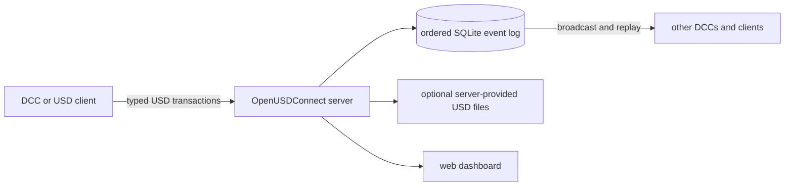

# OpenUSDConnect

OpenUSDConnect synchronizes supported OpenUSD scene changes between connected
applications. For example, when a user moves an imported object in Blender, the
Blender add-on sends that change to a central server. The server records the
change and sends it to another Blender instance, Unreal Engine, or a compatible
Python client.

- Send and receive supported scene edits with Blender, Unreal Engine, and Python
  clients. usdview can receive changes, and MCP clients can inspect or edit the
  server scene.
- Reconnect a client and apply the changes it missed from the server's event
  history.
- Join by opening the original USD file and entering the server address, or by
  opening an optional server-generated USD file that contains that information.
- View connected clients, scene layers, prims, and recent changes in a web
  dashboard.

## Getting Started

The basic Blender setup starts one local server and connects two Blender
instances. Each instance imports the included `test_scene.usda` file and
connects to the server at `127.0.0.1:7200`.

### 1. Install

Requirements: [Git](https://git-scm.com/), Python 3.13+,
[uv](https://docs.astral.sh/uv/), and Blender 4.4+. Python and `uv` run the
server and build the add-on; Blender uses its own Python and OpenUSD runtime.
The commands below work in PowerShell and POSIX-compatible shells.

```bash
git clone https://github.com/RoboticHuman/OpenUSDConnect.git
cd OpenUSDConnect
uv sync --group server --group dashboard
uv run python scripts/build_blender_addon.py
```

Install `dist/usd_connect_blender.zip` from Blender using
**Edit > Preferences > Add-ons > Install from Disk**.

### 2. Start The Server

```bash
uv run openusdconnect-server --base test_scene.usda --port 7200 --dashboard-port 8080
```

Keep this terminal open. When startup completes, it reports that the server is
listening on `127.0.0.1:7200` and the dashboard is running on port `8080`.

### 3. Open And Edit

1. In a Blender 3D Viewport, press `N` and open the **USD Connect** sidebar tab.
2. In that tab, choose **Import USD (with prim tagging)** and select
   `test_scene.usda`. Do not use Blender's standard **File > Import** command.
3. Confirm the emitter and receiver use `127.0.0.1:7200`.
4. Choose **Connect Emitter**, then **Start Receiver**.
5. Confirm the panel shows **Emitter connected** and **Receiver running**.
6. Repeat in a second Blender instance, then move, rotate, or scale any imported
   object in either instance.

The other instance follows automatically. The dashboard at
<http://127.0.0.1:8080> shows both clients and the resulting transactions. Stop
the server with `Ctrl+C` in its terminal. This local setup does not require an
external service, and synchronized edits do not overwrite `test_scene.usda`.

### Alternative: Open A Server-Provided USD File

The server-provided file option runs the same TCP synchronization server and
also creates a generated `scene.usd` file containing the current scene and
server address. It changes how an application opens and configures the scene;
live updates still travel through the sync server. After stopping the server
from the previous step, install the file-serving dependencies and run:

```bash
uv sync --group server --group vfs --group dashboard
uv run python scripts/start_live_open.py --base test_scene.usda --dashboard-port 8080 --open
```

The `--open` option opens the generated file's folder in the operating system's
file browser. In Blender, import the reported `scene.usd` from the **USD
Connect** tab. The add-on reads the server address and the file's position in
the event history, then can start sending and receiving changes automatically.
Stop the processes started by the launcher with:

```bash
uv run python scripts/start_live_open.py stop
```

See the [getting started guide](docs/getting-started.md) for verification,
platform paths, and troubleshooting.

## Integrations

| Integration | Direction | Best starting point |
| --- | --- | --- |
| **Blender** | Bidirectional | [Install, base-file connection, and server-provided file](docs/blender-addon-usage.md) |
| **Unreal Engine** | Bidirectional | [Plugin installation and live stage workflow](integrations/unreal/OpenUSDConnect/README.md) |
| **usdview** | Receive | [Launcher and viewer plug-in](integrations/usdview/README.md) |
| **Python / OpenUSD** | Bidirectional | [USD-native integration contract](docs/usd-native-integration.md) |
| **MCP** | Author and inspect | [Connect an MCP client](docs/mcp-server-usage.md) |
| **Dashboard** | Observe and administer | [Getting started](docs/getting-started.md#inspect-the-session) |

Blender and usdview can reconstruct the server's separate collaboration layers.
Blender can also continue from a flattened server-provided file. Unreal uses a
flattened scene state for both direct and server-provided file connections. Each
integration guide describes its setup requirements and current limitations.
Flattened continuation is limited to sessions with one unmuted collaboration
layer and no department policy; see
[server-provided USD files](docs/live-open.md#embedded-metadata).

`scripts/start_usdview.py` starts a temporary server, discovers the matching
usdview executable, and wires the receiver plugin. Use
`python -m integrations.usdview.launcher` to connect to an existing server.
For MaterialX and RenderMan, add `--renderman`; the launcher configures the
renderer environment and selects hdPrman when a compatible RenderMan/OpenUSD
installation is available.

## How It Works



Each integration converts local edits into typed USD messages. The server stores
those messages in an ordered SQLite event log and sends them to the other
clients. A client that joins late or reconnects requests the changes after the
last event it applied. The network protocol uses length-prefixed FlatBuffers
messages over TCP.

The core library is pure Python on top of `pxr`. Host integrations add the
stage ownership, native scene conversion, event-loop, and lifecycle behavior
required by each application.

| Synchronization mode | Use it for |
| --- | --- |
| `managed` | The default for DCC integrations. The server maintains collaboration layers and an event history for replay. |
| `shared_stage` | Synchronizing an existing root-and-sublayer graph. Every participant must begin with equivalent authored files and asset-resolution results; see the architecture guide for graph restrictions. |

See the [USD-native integration contract](docs/usd-native-integration.md) and
[shared-stage architecture](docs/shared-stage-architecture.md) before building
a custom integration.

## Feature Coverage

The project implements the following USD data across its core and bundled
integrations. Each integration supports the subset that its host application
can author or display; consult its guide for exact behavior.

- Transforms, visibility, prim lifecycle, typed attributes, primvars, and relationships
- Meshes, curves, points, native scenegraph instances, and point instancers
- UsdPreviewSurface, MaterialX, OpenPBR translation, textures, and material bindings
- References, payloads, variants, list operations, and shared file-layer editing
- Cameras, UsdLux lights and applied APIs, stage units, timelines, and playback
- Time-sampled transforms, attributes, shader inputs, and instancer data
- Custom property and metadata changes through exact Sdf field deltas

The server also provides:

- Managed collaboration layers with department ordering and mute controls
- TOFU authentication, rate limiting, compaction, and reconnect replay

The [documentation hub](docs/README.md) separates user guides, concepts,
reference material, examples, and contributor workflows.

## More Ways To Start

### Animated Instancing Demo

With a discoverable usdview installation:

```bash
uv sync --group server
uv run python examples/instancing_dance/run.py
```

### Material Zoo

Stream a material-rich scene into Blender, usdview, or both:

```bash
uv run python scripts/run_material_zoo.py --viewers blender
```

### Docker

```bash
docker compose --profile dashboard up
```

See the [example index](examples/README.md) and
[command-line reference](docs/cli-reference.md) for other workflows.

## Development

The default test suite is headless. Blender, Unreal, asset, slow, and visual
tiers are enabled explicitly as described in the [testing guide](docs/testing-setup.md).

```bash
uv sync --group server --group vfs --group mcp --group dev
uv run ruff check .
uv run pytest tests/unit -q
```

## Acknowledgments

- [USD Working Group Assets](https://github.com/usd-wg/assets) supplies the
  optional standardized assets used by integration and visual tests.

Licensed under the [Apache License 2.0](LICENSE).
