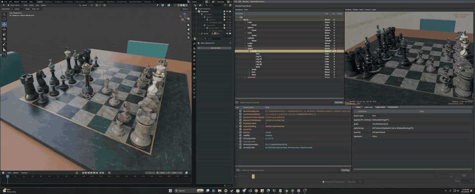
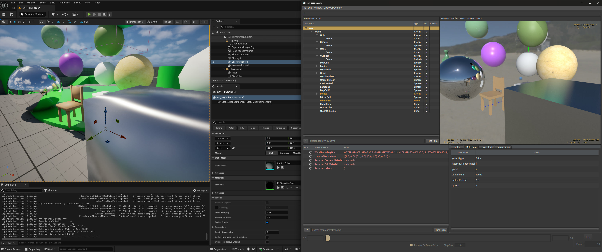
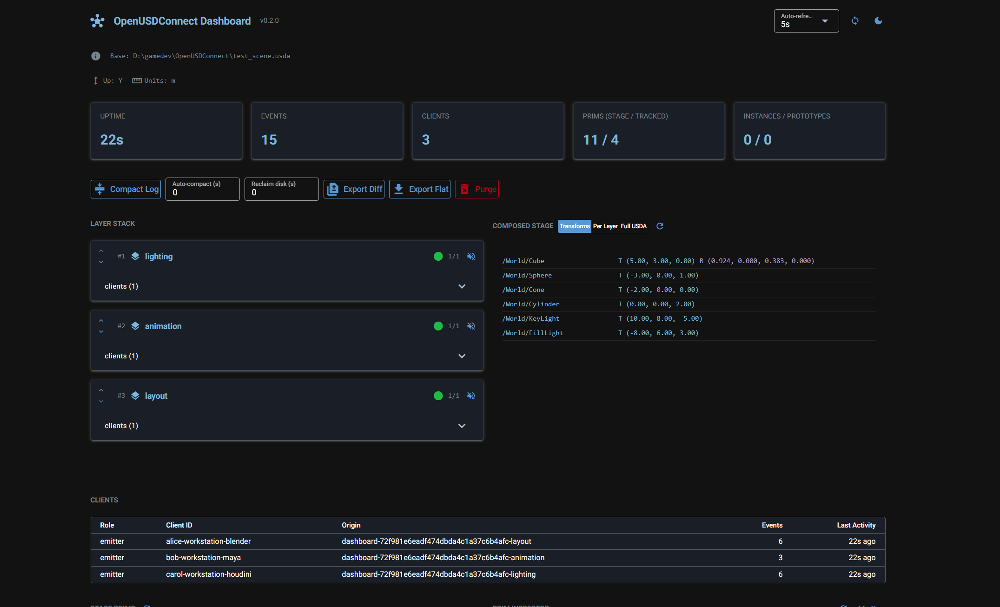
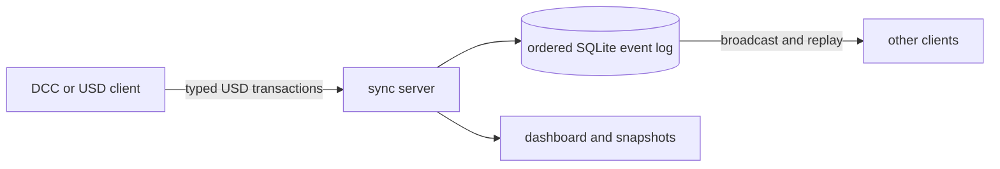

# OpenUSDConnect

OpenUSDConnect replicates USD edits between DCCs, USD-native tools, and
headless services. The repository includes reference integrations for Blender,
usdview, Unreal Engine, MCP, and Python. They all use the same protocol; the
core has no dependency on a DCC.



The server orders typed transactions, commits them to SQLite, and broadcasts
them to connected clients. A client that joins late or reconnects replays the
same log.

## Capabilities

- Atomic, ordered transactions with durable acknowledgements and reconnect replay
- Transforms, geometry, primvars, cameras, lights, visibility, and animation
- References, payloads, variants, instances, point instancers, relationships,
  metadata, and exact Sdf field changes
- UsdPreviewSurface and MaterialX values, bindings, NodeGraphs, and connections
- Managed collaboration layers and exact shared-stage layer synchronization
- TOFU authentication, rate limiting, playback leadership, log compaction,
  dashboard administration, and optional live-open snapshots

Host integrations only project the USD features their application can
represent. Unsupported state remains in the authoritative USD stage or the
client's receive mirror.

## Get started

You need [Git](https://git-scm.com/), Python 3.13+, and
[uv](https://docs.astral.sh/uv/). Use the OpenUSD build from your project when
possible. Clone with `--recursive` only if you need the USD Working Group
assets used by asset and visual tests.

### Configure your OpenUSD build

Use the same compatible OpenUSD build and plugin environment as the other
clients in the session. MaterialX and custom renderers, resolvers, file
formats, and shader definitions depend on that environment.

```bash
git clone https://github.com/RoboticHuman/OpenUSDConnect.git
cd OpenUSDConnect
```

The active interpreter must use the same Python major/minor version that
OpenUSD was built against.
The launchers search the install prefix for current Windows
`Lib/site-packages`, Unix `lib/pythonX.Y/site-packages` or `dist-packages`, and
legacy `lib/python` layouts. Activate the matching venv first when necessary;
its site-packages is also searched. Use `-PythonPath` or `--python-path` only
when the bindings are in another location.

Configure the current PowerShell session on Windows:

```powershell
. .\scripts\openusd_env.ps1 "D:\OpenUSDInstall"
uv sync
```

Or configure the current Bash/Zsh session on Linux or macOS:

```bash
source scripts/openusd_env.sh /opt/OpenUSDInstall
```

For automation or CI, configure only the child command:

```bash
uv run python scripts/run_with_openusd.py --usd-root /path/to/OpenUSD -- \
  openusdconnect-server --base test_scene.usda
```

The [CLI reference](docs/cli-reference.md#openusd-runtime-and-custom-plugins)
covers venv layouts, external bindings, interpreter selection, plugin and DLL
paths, RenderMan, verification, and every launcher option. Commands below
assume that runtime remains active; wrapper users place them after `--`.

### Verify synchronization locally

This command starts a temporary server and two USD-native clients, checks both
directions of replication, and exits:

```bash
uv run python examples/usd_native_client/run.py --no-usdview --seconds 3
```

A successful run reports `local_valid=True` and `peer_valid=True`.

### Run a persistent server

```bash
uv run openusdconnect-server --base test_scene.usda --port 7200
```

Use `uv run openusdconnect-server --help` for all options. Common additions are
`--departments animation,lighting,fx`, `--require-token`, and
`--dashboard-port 8080`.

### Bundled core fallback

The bundled `usd-core` runtime is suitable for core synchronization, standard
USD schemas, and UsdPreviewSurface. It does not include MaterialX or custom
renderer, resolver, file-format, or shader plugins.

```bash
uv sync --group bundled-usd
uv run python examples/usd_native_client/run.py --no-usdview --seconds 3
```

Do not add `bundled-usd` when using the project runtime path above.

## Integrations

| Integration | Direction | Start here |
| --- | --- | --- |
| Blender addon | Bidirectional | [Blender guide](docs/blender-addon-usage.md) |
| usdview plugin | Receive | [usdview guide](integrations/usdview/README.md) |
| Unreal Engine plugin | Bidirectional, currently flat receive | [Unreal guide](integrations/unreal/OpenUSDConnect/README.md) |
| Python / OpenUSD | Bidirectional | [USD-native API guide](docs/usd-native-integration.md) |
| Custom native scene | Receive | [Qt integration example](examples/qt_native_viewer/README.md) |
| MCP server | Author and inspect | `uv run --group mcp python -m integrations.mcp`; [MCP guide](docs/mcp-server-usage.md) |
| Dashboard | Observe and administer | `uv run --group dashboard python scripts/demo_layer_dashboard.py` |

Build the Blender add-on with `uv run python scripts/build_blender_addon.py`, or
start a connected usdview session with
`uv run python scripts/start_usdview.py test_scene.usda`.

### Run the cross-application Material Zoo

See the same live material scene in Blender, usdview, and Unreal Engine:

```bash
# Add --download-blender to install a repo-local portable Blender when needed.
uv run python scripts/run_material_zoo.py --viewers blender usdview unreal
```

The runner finds the selected applications, starts a temporary server, and
streams a shared camera and environment light. Pass any subset of the three
viewers. When usdview is selected, add `--renderman` to launch it with a
compatible hdPrman setup. The
[testing guide](docs/testing-setup.md#inspect-the-material-zoo-interactively)
documents runtime selection and additional options.

<p align="center">
  
</p>
<p align="center"><em>The same synchronized scene in Unreal Engine (left) and usdview with RenderMan (right).</em></p>

### Inspect collaboration in the dashboard

The dashboard shows connected clients, department layers, composed stage data,
persisted events, and log maintenance and export controls.



## Python client API

Use `ManagedClient` for a bidirectional application that owns a
`pxr.Usd.Stage`:

```python
from pxr import Usd

from openusdconnect import ClientPhase, ManagedClient

stage = Usd.Stage.Open("scene.usda")

with ManagedClient(stage, app_name="my-editor") as client:
    if not client.connect(timeout=5):
        raise ConnectionError("OpenUSDConnect server is unavailable")

    while application_is_running():
        client.update()
        if client.status.phase is ClientPhase.READY:
            edit_scene(stage)
```

Call `update()` on the stage-owning thread. Use `flush(timeout)` at save,
publish, or orderly-shutdown boundaries when acknowledgement matters. Receive-
only tools can use `UsdReceiver`; send-only tools can use `UsdPublisher`.
The [USD-native API guide](docs/usd-native-integration.md) covers ownership,
replay, reconnection, recovery, and shared-stage clients.

## How it works



Messages are length-prefixed FlatBuffers frames over TCP. Managed clients
reconstruct the authoritative USD state; host adapters project representable
changes into the native scene.

| Mode | Use it for | API |
| --- | --- | --- |
| `managed` (default) | DCC and service integrations that exchange semantic events through server-owned collaboration layers | `ManagedClient`, `UsdPublisher`, `UsdReceiver` |
| `shared_stage` | Applications synchronizing an existing root and recursive sublayer graph field-for-field | `SharedStageClient` |

All participants must resolve equivalent base content and assets. Managed
layered clients open the original base stage; generated live-open snapshots are
continuation baselines only for integrations that support them. Managed clients
keep their transient authoring layer selected while active. Shared-stage clients
synchronize in-memory authored layer contents but do not save files.
See the [integration contract](docs/usd-native-integration.md) and
[shared-stage architecture](docs/shared-stage-architecture.md) before building
a custom integration.

## Additional workflows

### Live-open snapshots

Expose the composed managed scene as a local USD file while updates continue
through the sync server:

```bash
uv sync --group vfs
uv run python scripts/start_live_open.py --base test_scene.usda --open
```

Flat snapshot continuation requires one unmuted collaboration layer and no
department policy. Use the original base scene when layer ordering or muting
must be preserved. See [Server-provided USD files](docs/live-open.md).

### Shared-stage synchronization

```bash
uv run openusdconnect-server --base shot.usda --layer-mode shared_stage
```

Every participant must begin with an equivalent root and sublayer graph. Native
USD hosts can optionally build the exact Sdf notice bridge with
`uv run openusdconnect-build-sdf-notice-bridge`.

## Documentation

- [Documentation index](docs/README.md)
- [Getting started with Blender](docs/getting-started.md)
- [USD-native API guide](docs/usd-native-integration.md)
- [Client recovery](docs/client-recovery.md)
- [Blender addon](docs/blender-addon-usage.md)
- [Live material editing](docs/live-material-editing.md)
- [Server-provided USD files and VFS](docs/live-open.md)
- [Shared-stage architecture](docs/shared-stage-architecture.md)
- [MCP server](docs/mcp-server-usage.md)
- [Command-line reference](docs/cli-reference.md)
- [Testing](docs/testing-setup.md)
- [Profiling](docs/profiling.md)

## Development

```bash
uv sync --group vfs --group dev
uv run pytest tests/unit/ -v
uv run pytest tests/ -v
uv run ruff check
```

Blender, Unreal, asset, RenderMan, and visual tiers are opt-in because they need
external runtimes or assets. Add `--group bundled-usd` only for a
renderer-neutral test environment that does not need MaterialX or custom
plugins. The [testing guide](docs/testing-setup.md) lists every tier.

## Docker

The included image uses the renderer-neutral `usd-core` runtime:

```bash
docker build -t openusdconnect-server .
docker run -p 7200:7200 -v ./scenes:/scenes \
  openusdconnect-server --base /scenes/scene.usda
```

## Acknowledgments

- [USD Working Group Assets](https://github.com/usd-wg/assets), used by the
  integration and visual test suites

Licensed under the [Apache License 2.0](LICENSE).
