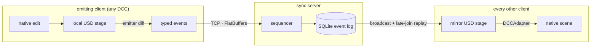

# OpenUSDConnect

Real-time OpenUSD scene synchronization across DCC applications. A pure-Python
core and an authoritative sync server keep OpenUSD stages consistent across
Blender, usdview, Unreal Engine, and headless clients over a local network.
Transforms, geometry, materials, composition arcs, instancing, cameras, lights,
animation, and playback all replicate live through a compact event protocol.

## Overview

OpenUSDConnect is a **general-purpose USD livelink framework**, not a
single-DCC plugin. The core library (`openusdconnect/`) is pure Python on top of
the OpenUSD bindings (`pxr`), has no DCC dependencies, and is fully testable
headless. The bundled integrations (Blender, usdview, Unreal, an MCP authoring
server) are **reference clients**: thin emit/receive layers on the core, meant
to be used as-is and to serve as templates for building integrations for other
hosts (Maya, Houdini, and so on). The protocol itself is DCC-agnostic.

Scene changes are expressed as a fixed vocabulary of **events** (`ensure_prim`,
`set_xform_trs`, `set_material_binding`, and so on) that map directly to USD spec
operations. Clients emit events when their stage changes; the server sequences
them into an authoritative, append-only log and fans them out to every connected
client, which applies them to its own stage. The wire format is length-prefixed
FlatBuffers over TCP.



The boxes are roles, not machines: a bidirectional client runs both halves
at once, emitting its own edits while applying everyone else's. The server
never echoes an event back to its origin.

## Features

### Sync server
- Authoritative sequencer with atomic, ordered transactions
- SQLite event log with late-join replay (sync from any sequence) and log compaction
- WebDAV/UNC live-open endpoint that serves a normal-looking USD snapshot
- Per-department shared layers with configurable strength ordering
- Cross-department edit proposals (propose, approve, reject)
- TOFU (trust-on-first-use) token authentication and per-client rate limiting
- Single-leader playback synchronization (a shared playhead)
- Optional web admin dashboard with a live prim tree and event inspector

### USD coverage
- **Transforms**: translate / orient / scale with quaternion rotation; partial TRS updates
- **Geometry**: meshes, curves, points; typed attributes, primvars and interpolation; visibility
- **Custom property data**: exact Sdf field deltas for locally authored custom attributes, relationships, and metadata not represented by specialized events
- **Materials and shaders**: UsdPreviewSurface and MaterialX (`ND_*`) networks, nested NodeGraphs, per-purpose bindings
- **Composition**: exact reference and payload list-op opinions, including
  offsets, scales, reference custom data, payload load/unload, and variant
  selections
- **Instancing**: native scenegraph instancing and `UsdGeomPointInstancer`
- **Cameras and lights**: `UsdGeomCamera`; `UsdLux` lights with applied API schemas (Shaping, Shadow, and others)
- **Stage metadata**: units (`metersPerUnit`, `upAxis`) and timeline (fps, time codes, range)
- **Animation**: time-sampled values on transforms, visibility, attributes, shader inputs, and point instancers
- **Prim lifecycle**: create, rename, delete, deactivate

### Integrations
These ship as **reference implementations**: working clients you can run today,
and worked examples for writing your own. Each is a thin layer on the core
library, so a new host integration is mostly mapping its scene to the same
emit/receive event flow.

| Integration | Direction | Notes |
|---|---|---|
| **Blender** | bidirectional | Emitter/receiver addon: live transform and material sync (UsdPreviewSurface, MaterialX), Y-up/Z-up conversion, depsgraph auto-tracking, live-open metadata auto-connect |
| **usdview** | receive | Live viewer plugin and launcher; RenderMan-safe (Sdr plugin bootstrap) with OpenPBR to standard_surface translation for hdPrman |
| **Unreal Engine** | bidirectional | Transform/visibility emit; receive-side composition arcs, variants, bindings, shader networks, and live-open metadata via `USDStageActor` |
| **MCP server** | author + introspect | Exposes the event protocol as Model Context Protocol tools so an LLM (e.g. Claude) can author USD and inspect scenes |
| **Dashboard** | admin | Web admin UI: status, client table, prim tree, event log |

## Getting started

### Clone
The repository vendors the [USD Working Group asset library](https://github.com/usd-wg/assets)
as a git submodule (`assets/`), used by the visual-regression and asset E2E test
suites. Clone recursively so it comes along:

```bash
git clone --recursive https://github.com/RoboticHuman/OpenUSDConnect.git
```

Already cloned without `--recursive`? Pull the submodule in:

```bash
git submodule update --init --recursive
```

### Prerequisites
- Python 3.13+
- [uv](https://docs.astral.sh/uv/)
- OpenUSD Python bindings (`pxr`): pulled in by the `server` dependency group for
  headless use, provided by the DCC for integrations, or by `usd-core` in Docker

Optional features are opt-in dependency groups: `server` (headless `pxr`),
`vfs` (WebDAV live-open), `dashboard`, `mcp`, `dev` (tests and lint),
`profile`.

### Run the sync server
```bash
# Install headless dependencies (pulls pxr via usd-core)
uv sync --group server

# Start the server
uv run openusdconnect-server --port 7200 --base scene.usda

# Serve a browsable live-open snapshot at http://127.0.0.1:7280/usd/scene.usd
uv sync --group server --group vfs
uv run openusdconnect-server --port 7200 --base scene.usda --vfs-port 7280

# With the admin dashboard (uv sync --group dashboard)
uv run openusdconnect-server --port 7200 --base scene.usda --dashboard 8080

# With per-department layers and authentication
uv run openusdconnect-server --port 7200 --base scene.usda \
  --departments animation,lighting,fx --require-token
```

Department ordering is preserved by server restart and log compaction. Current
receivers replay department-tagged records into one local edit layer, however,
so receiver-side replay does not reconstruct cross-department layer strength.
Some live event kinds also lack a composed-value correction. The server stage
remains authoritative; layered receiver replay needs a protocol extension.

If a Hydra renderer such as RenderMan is installed into the shared USD build,
launch through the renderer-safe wrapper so the Sdr registry can load its plugins:

```bash
uv run python -m integrations.run_server --port 7200 --base scene.usda
```

### Live-open VFS
The VFS endpoint exposes a small virtual directory with `scene.usd` as a
flattened snapshot and `scene.live.usda` as the composition root. Both contain
`customLayerData["openusdconnect"]` so plugin-enabled DCCs can import/open the
file normally, read the live endpoint metadata, and start from the snapshot
sequence instead of replaying old events.

```powershell
# Windows WebDAV/UNC form
\\127.0.0.1@7280\usd\scene.usd

# Map a drive if the Windows WebClient service is available
uv run python scripts/mount_vfs_share.py --port 7280 --drive O: --open

# No-admin local bridge: server + VFS + O: drive helper
uv run python scripts/start_live_open.py --base scene.usda --drive O: --open --force
```

For write fallback, start the server with `--vfs-write-mode translate`. Full-file
USD saves are validated by default, rejected when stale or invalid, and converted
to live events when safe.

### Docker

The server image uses [`usd-core`](https://pypi.org/project/usd-core/) from PyPI
for headless OpenUSD support.

```bash
# Build the server image
docker build -t openusdconnect-server .

# Run the server
docker run -p 7200:7200 -p 7280:7280 -v ./scenes:/scenes \
  openusdconnect-server --port 7200 --base /scenes/scene.usda --vfs-port 7280

# Build and run with dashboard support
docker build --build-arg DASHBOARD=1 -t openusdconnect-server:dashboard .
docker run -p 7200:7200 -p 7280:7280 -p 8080:8080 -v ./scenes:/scenes \
  openusdconnect-server:dashboard \
  --port 7200 --base /scenes/scene.usda --vfs-port 7280 --dashboard 8080
```

Or using Docker Compose:

```bash
docker compose --profile default up      # server only
docker compose --profile dashboard up    # server + dashboard
```

### Blender addon
```bash
uv run python scripts/build_blender_addon.py
```
Install the output zip (`dist/usd_connect_blender.zip`) in Blender via
**Edit > Preferences > Add-ons > Install from Disk**.

For seamless live-open, import `\\127.0.0.1@7280\usd\scene.usd` or
`O:\scene.usd` with **Import USD (with Prim Tagging)**. The addon reads embedded
metadata and can auto-start receiver/emitter when the import-panel options are
enabled.

### usdview
```bash
uv run python -m integrations.usdview.launcher scene.usda --port 7200
# add --renderman to use the hdPrman delegate
```

### Unreal Engine
The Unreal integration is a UE5 plugin (with a Python launcher for live edits).
Requirements, installation, and the two-way sync walkthrough are in the
[Unreal plugin README](integrations/unreal/OpenUSDConnect/README.md).
The plugin can also open the VFS snapshot in USD Stage and use its embedded
metadata for host, port, receiver replay position, and persisted TOFU token reuse.

### MCP server (LLM authoring)
```bash
uv sync --group mcp
uv run python -m integrations.mcp     # stdio MCP server
```
Register it with an MCP client (e.g. Claude Code or Desktop) and point it at a
running sync server. See [MCP Server Usage](docs/mcp-server-usage.md).

## Documentation
- [Blender Addon Usage](docs/blender-addon-usage.md): installation, UI overview, live-sync walkthrough
- [Live-Open Quickstart](docs/live-open-quickstart.md): WebDAV/UNC live-open and metadata sync
- [Live Material Editing](docs/live-material-editing.md): material and shader synchronization
- [Unreal Engine Plugin](integrations/unreal/OpenUSDConnect/README.md): UE5 plugin requirements, install, two-way sync
- [MCP Server Usage](docs/mcp-server-usage.md): tools, configuration, Claude client setup
- [Testing Setup](docs/testing-setup.md): test tiers, Blender configuration, adding tests
- [Profiling](docs/profiling.md): performance profiling with py-spy

## Testing
```bash
uv run pytest tests/unit/ -v                                   # unit (fast, no DCC)
uv run pytest tests/ -v                                        # plus headless integration
uv run pytest tests/integration/asset_tests/ --asset-tests -v  # asset E2E (requires Blender)
uv run pytest tests/visual --visual-tests -v                   # visual regression (RenderMan + submodule)
```

## Acknowledgments
- [USD Working Group Assets](https://github.com/usd-wg/assets): standardized test assets for the integration test suite
