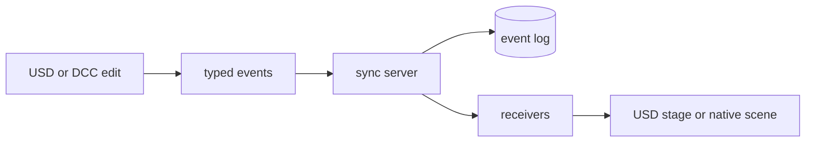

# OpenUSDConnect

OpenUSDConnect synchronizes live OpenUSD scene edits across DCC applications,
USD-native tools, and headless services. Its Python core is DCC-independent;
Blender, usdview, Unreal Engine, and MCP integrations are reference clients
built on the same event protocol.

Changes are sent as typed USD operations, sequenced by an authoritative server,
stored in SQLite, and replayed to connected or late-joining clients. The wire
format is length-prefixed FlatBuffers over TCP.



## Choose a collaboration mode

OpenUSDConnect has two explicit layer models:

| Mode | Use it when | Client API |
| --- | --- | --- |
| `managed` (default) | The server owns collaboration layers and semantic events must reach USD and non-USD consumers. Supports departments, playback, dashboard, MCP, and live-open snapshots. | `ManagedClient`, `UsdPublisher`, `UsdReceiver` |
| `shared_stage` | Every process opens an equivalent portable root and sublayer graph and authored Sdf fields must be routed to the corresponding application-owned layers. | `SharedStageClient` |

Managed mode is the normal choice for livelink integrations. Shared-stage mode
is for applications editing the same production layer graph field-for-field.
The modes have different handshakes and cannot be mixed on one server.

## Capabilities

- Atomic, ordered transactions with durable acknowledgements and replay
- Transforms, geometry, primvars, cameras, lights, visibility, and animation
- References, payloads, variants, instanceability, and point instancers
- UsdPreviewSurface and MaterialX values, bindings, NodeGraphs, and connections
- Exact Sdf field deltas for custom properties, relationships, metadata, and
  authored state not represented by a specialized event
- Managed collaboration-layer ordering and muting, including department policy
- Shared-stage root and recursive sublayer topology synchronization
- TOFU authentication, rate limiting, playback leadership, log compaction,
  optional dashboard, and WebDAV live-open snapshots

The protocol preserves USD state more broadly than every native DCC can display.
Managed layered integrations reconstruct the authoritative USD state in a
mirror or application stage, then a host adapter applies the subset its native
scene can represent.

## Quick start

### Install and run the server

Python 3.13+ and [uv](https://docs.astral.sh/uv/) are required for the headless
server. Clone recursively if you also want the USD Working Group assets used by
the asset and visual tests.

```bash
git clone --recursive https://github.com/RoboticHuman/OpenUSDConnect.git
cd OpenUSDConnect
uv sync --group bundled-usd
uv run openusdconnect-server --base scene.usda --port 7200
```

Use `uv run openusdconnect-server --help` for server options. Common additions
are `--departments animation,lighting,fx`, `--require-token`, and
`--dashboard-port 8080`.

### Choose an OpenUSD runtime

The `bundled-usd` dependency group installs `usd-core`: a renderer-neutral and
custom-plugin-free runtime. It supports core synchronization and standard USD
schemas, including UsdPreviewSurface.

Use your project's OpenUSD runtime when the scene depends on custom renderers,
resolvers, file formats, or shader definitions. From the repository root,
activate it for the current PowerShell terminal, then run commands normally:

```powershell
.\scripts\openusd_env.ps1 "C:\path\to\OpenUSDInstall"
uv run --isolated openusdconnect-server --base scene.usda
```

The first positional argument is the OpenUSD install directory containing
`bin` and `lib`. Pass `-RenderManRoot`, `-PluginPath`, or `-DllDir` when needed.
For automation or other shells, use the cross-platform command wrapper:

```bash
uv run python scripts/run_with_openusd.py --usd-root /path/to/OpenUSD -- \
  openusdconnect-server --base scene.usda
```

Repeat `--plugin-path` or `--dll-dir` for project plugins and native
dependencies. Add `--renderman-root /path/to/RenderManProServer` for hdPrman.

The server and source-tree launchers inherit the active environment. Plugin
discovery uses `PXR_PLUGINPATH_NAME`; native dependencies use `PATH` on Windows,
`LD_LIBRARY_PATH` on Linux, or `DYLD_LIBRARY_PATH` on macOS. Windows users can
also set `OPENUSDCONNECT_DLL_DIRS` or pass `--plugin-dll-dir` to commands that
provide it. RenderMan is discovered automatically when `RMANTREE` is set.

See [OpenUSD runtime and custom plugins](docs/cli-reference.md#openusd-runtime-and-custom-plugins)
for setup and verification.

### Connect a USD-native application

`ManagedClient` is the usual bidirectional API for applications that own a
`pxr.Usd.Stage`:

```python
from pxr import Usd

from openusdconnect import ClientPhase, ManagedClient

stage = Usd.Stage.Open("scene.usda")

with ManagedClient(stage, app_name="my-editor") as client:
    if not client.connect(timeout=5):
        raise ConnectionError("OpenUSDConnect server is unavailable")

    while application_is_running():
        client.update()
        if client.status.phase is ClientPhase.READY:
            # ManagedClient selects client.authoring_layer as the edit target.
            edit_scene(stage)
```

Call `update()` on the stage-owning thread. `connect()` completes the network
handshakes, but replay becomes visible only as `update()` applies it. Interactive
updates do not wait for durability. At a save, publish, or orderly-shutdown
boundary, call `update()` to submit the latest edits and then `flush(timeout)`
to wait for their acknowledgement.

Use `UsdReceiver` for receive-only tools, `UsdPublisher` for send-only tools,
and `SharedStageClient` for exact authored-layer synchronization. The
[USD-native API guide](docs/usd-native-integration.md) explains ownership,
replay, reconnection, adapters, and the cases that require recovery.

## Integrations

| Integration | Direction | Entry point |
| --- | --- | --- |
| Blender addon | Bidirectional | `uv run python scripts/build_blender_addon.py` |
| usdview plugin | Receive | `uv run python scripts/start_usdview.py scene.usda` |
| Unreal Engine plugin | Bidirectional, currently flat receive | [Unreal plugin guide](integrations/unreal/OpenUSDConnect/README.md) |
| MCP server | Author and inspect | `uv run python -m integrations.mcp` |
| Dashboard | Administration | `uv run --group bundled-usd --group dashboard python scripts/demo_layer_dashboard.py` |

### Run the cross-application Material Zoo

See the same live material scene in Blender, usdview, and Unreal Engine:

```bash
uv run python scripts/run_material_zoo.py --viewers blender usdview unreal
```

The runner discovers the selected applications, starts a temporary server,
connects each integration, and streams the Material Zoo with a shared camera
and environment light. Select any subset of the three viewers. See the
[testing guide](docs/testing-setup.md#inspect-the-material-zoo-interactively)
for runtime selection and additional options.

The Blender addon zip is written to `dist/usd_connect_blender.zip`. Install it
through **Edit > Preferences > Add-ons > Install from Disk**. See the
[Blender guide](docs/blender-addon-usage.md) for normal and live-open workflows.

`scripts/start_usdview.py` starts a temporary server, discovers the matching
usdview executable, and wires the receiver plugin. Use
`python -m integrations.usdview.launcher` to connect to an existing server.
For MaterialX and RenderMan, add `--renderman`; the launcher configures the
renderer environment and selects hdPrman when a compatible RenderMan/OpenUSD
installation is available.

## Live-open snapshots

Managed servers can expose a normal-looking USD file over WebDAV. The
workstation launcher starts the server, VFS endpoint, and a write-capable local
mirror:

```bash
uv sync --group bundled-usd --group vfs
uv run python scripts/start_live_open.py --base scene.usda --open
```

Import the reported local `scene.usd` in a metadata-aware integration. The
snapshot contains the composed state and a replay sequence, so the integration
continues from the next event rather than replaying history over the snapshot.
Flat snapshot continuation requires one unmuted collaboration layer and no
department policy. Use the original base scene with layered replay when layer
ordering or muting matters.

See the [Live-Open Quickstart](docs/live-open-quickstart.md) for mounts, write
modes, metadata, and security boundaries.

## Shared-stage requirements

Start a dedicated server with:

```bash
uv run openusdconnect-server --base shot.usda --layer-mode shared_stage
```

Every participant must resolve the root document and recursive sublayers to
equivalent authored contents. OpenUSDConnect routes layers with opaque keys and
does not transmit local filesystem paths or a complete baseline. It currently
does not prove that untouched baseline data is identical, so the integration
must establish that invariant through versioned assets, deployment policy, or
its resolver.

The portable Python tracker keeps complete layer snapshots. Native USD hosts
can build the optional exact-build Sdf notice bridge to capture old values
without those snapshots:

```bash
uv run openusdconnect-build-sdf-notice-bridge
```

See the [USD-native API guide](docs/usd-native-integration.md#shared-authored-layer-editing)
and [shared-stage architecture](docs/shared-stage-architecture.md).

## Important integration boundaries

- Managed clients must open the original base stage. A generated live-open
  snapshot is a continuation baseline and is rejected by layered clients.
- A `ManagedClient` owns one transient `authoring_layer`; keep it as the edit
  target while the client is active. Use separate `UsdPublisher` and
  `UsdReceiver` stages for applications that intentionally author other layers.
- Asset identifiers stay as USD identifiers. Each process must load compatible
  `ArResolver` plugins and contexts.
- A resolver-context remap that changes composition without an authored USD
  edit cannot be projected incrementally into a non-USD native scene. Rebuild
  or replace that native destination before resuming.
- `SharedStageClient` synchronizes in-memory authored layer contents. It never
  calls `Sdf.Layer.Save()`; file or database persistence remains application
  policy.

## Documentation

- [USD-native API guide](docs/usd-native-integration.md)
- [Client recovery](docs/client-recovery.md)
- [Blender addon](docs/blender-addon-usage.md)
- [Live material editing](docs/live-material-editing.md)
- [Live-open and VFS](docs/live-open-quickstart.md)
- [Shared-stage architecture](docs/shared-stage-architecture.md)
- [MCP server](docs/mcp-server-usage.md)
- [Command-line reference](docs/cli-reference.md)
- [Testing](docs/testing-setup.md)
- [Profiling](docs/profiling.md)

## Development

```bash
uv sync --group bundled-usd --group vfs --group dev
uv run pytest tests/unit/ -v
uv run pytest tests/ -v
uv run ruff check
```

Blender asset tests and RenderMan visual tests are opt-in because they require
external runtimes and assets. The [testing guide](docs/testing-setup.md) lists
the exact commands and setup.

## Docker

The included image uses the renderer-neutral and custom-plugin-free `usd-core`
runtime:

```bash
docker build -t openusdconnect-server .
docker run -p 7200:7200 -v ./scenes:/scenes \
  openusdconnect-server --base /scenes/scene.usda
```

## Acknowledgments

- [USD Working Group Assets](https://github.com/usd-wg/assets), used by the
  integration and visual test suites
