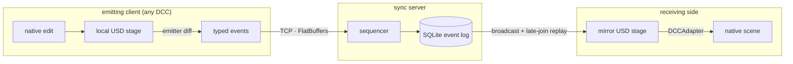

# OpenUSDConnect

Real-time OpenUSD scene synchronization across DCC applications. A pure-Python
core and an authoritative sync server keep OpenUSD stages consistent across
Blender, usdview, Unreal Engine, and headless clients over a local network.
Transforms, geometry, materials, composition arcs, instancing, cameras, lights,
animation, and playback all replicate live through a compact event protocol.

## Overview

OpenUSDConnect is a **general-purpose USD livelink framework**, not a
single-DCC plugin. The core library (`openusdconnect/`) is pure Python on top of
the OpenUSD bindings (`pxr`), has no DCC dependencies, and is fully testable
headless. The bundled integrations (Blender, usdview, Unreal, an MCP authoring
server) are **reference clients**. They combine the core protocol with the
host-specific stage ownership, event-loop, conversion, and lifecycle policy
needed by each application. The protocol itself is DCC-agnostic.

Scene changes are expressed as a fixed vocabulary of **events** (`ensure_prim`,
`set_xform_trs`, `set_material_binding`, and so on) that map directly to USD spec
operations. Clients emit events when their stage changes; the server sequences
them into an authoritative, append-only log and fans them out to every connected
client, which applies them to its own stage. The wire format is length-prefixed
FlatBuffers over TCP.



The boxes are roles, not machines: a bidirectional client runs both halves
at once. Flat receivers suppress ordinary origin echoes. Layered receivers
also replay their own authored records into an independent mirror so its
reconstructed layer stack remains complete; the emitter's authoring stage is
not used as that mirror.

## Features

### Sync server
- Authoritative sequencer with atomic, ordered transactions
- SQLite event log with late-join replay (sync from any sequence) and log compaction
- WebDAV/UNC live-open endpoint that serves a normal-looking USD snapshot
- Per-department shared layers with configurable strength ordering
- Cross-department edit proposals (propose, approve, reject)
- TOFU (trust-on-first-use) token authentication and per-client rate limiting
- Single-leader playback synchronization (a shared playhead)
- Optional web admin dashboard with a live prim tree and event inspector

### USD coverage
- **Transforms**: translate / orient / scale with quaternion rotation; partial TRS updates
- **Geometry**: meshes, curves, points; typed attributes, primvars and interpolation; visibility
- **Custom property data**: exact Sdf field deltas for locally authored custom attributes, relationships, and metadata not represented by specialized events
- **Materials and shaders**: UsdPreviewSurface and MaterialX (`ND_*`) networks, nested NodeGraphs, per-purpose bindings
- **Composition**: exact reference and payload list-op opinions, including
  offsets, scales, reference custom data, payload load/unload, and variant
  selections
- **Shared file layers**: opt-in synchronization of an existing root layer and
  its recursive sublayer graph, including topology, offsets, metadata,
  variants, custom properties, connections, targets, and time samples
- **Instancing**: native scenegraph instancing and `UsdGeomPointInstancer`
- **Cameras and lights**: `UsdGeomCamera`; `UsdLux` lights with applied API schemas (Shaping, Shadow, and others)
- **Stage metadata**: units (`metersPerUnit`, `upAxis`) and timeline (fps, time codes, range)
- **Animation**: time-sampled values on transforms, visibility, attributes, shader inputs, and point instancers
- **Prim lifecycle**: create, rename, delete, deactivate

### Integrations
These ship as **reference implementations**: working clients you can run today,
and worked examples for writing your own. A new host integration maps its scene
to the common event flow and defines how it owns authoring and receive-side USD
stages.

| Integration | Direction | Notes |
|---|---|---|
| **Blender** | bidirectional | Emitter/receiver addon: live transform and material sync (UsdPreviewSurface, MaterialX), Y-up/Z-up conversion, depsgraph auto-tracking, live-open metadata auto-connect |
| **usdview** | receive | Live viewer plugin and launcher; RenderMan-safe (Sdr plugin bootstrap) with OpenPBR to standard_surface translation for hdPrman |
| **Unreal Engine** | bidirectional | Transform/visibility emit; receive-side composition arcs, variants, bindings, shader networks, and live-open metadata via `USDStageActor` |
| **MCP server** | author + introspect | Exposes the event protocol as Model Context Protocol tools so an LLM (e.g. Claude) can author USD and inspect scenes |
| **Dashboard** | admin | Web admin UI: status, client table, prim tree, event log |

## Getting started

### Clone
The repository vendors the [USD Working Group asset library](https://github.com/usd-wg/assets)
as a git submodule (`assets/`), used by the visual-regression and asset E2E test
suites. Clone recursively so it comes along:

```bash
git clone --recursive https://github.com/RoboticHuman/OpenUSDConnect.git
```

Already cloned without `--recursive`? Pull the submodule in:

```bash
git submodule update --init --recursive
```

### Prerequisites
- Python 3.13+
- [uv](https://docs.astral.sh/uv/)
- OpenUSD Python bindings (`pxr`): pulled in by the `server` dependency group for
  headless use, provided by the DCC for integrations, or by `usd-core` in Docker

Optional features are opt-in dependency groups: `server` (headless `pxr`),
`vfs` (WebDAV live-open), `dashboard`, `mcp`, `dev` (tests and lint),
`profile`.

### Run the sync server
```bash
# Install headless dependencies (pulls pxr via usd-core)
uv sync --group server

# Start the server
uv run openusdconnect-server --port 7200 --base scene.usda

# Serve a browsable live-open snapshot at http://127.0.0.1:7280/usd/scene.usd
uv sync --group server --group vfs
uv run openusdconnect-server --port 7200 --base scene.usda --vfs-port 7280

# With the admin dashboard (uv sync --group dashboard)
uv run openusdconnect-server --port 7200 --base scene.usda --dashboard-port 8080

# With per-department layers and authentication
uv run openusdconnect-server --port 7200 --base scene.usda \
  --departments animation,lighting,fx --require-token

# Configure a custom URI resolver context (repeat for multiple resolvers)
uv run openusdconnect-server --port 7200 --base scene.usda \
  --resolver-context asset:/show/config/versions.json
```

CLI naming follows the endpoint being configured: dedicated tools use
`--host`/`--port`, while combined launchers qualify the WebDAV endpoint as
`--vfs-host`/`--vfs-port`/`--vfs-share`/`--vfs-name`. Persistence and optional
services use `--event-log` and `--dashboard-port`.
See [Command-Line Reference](docs/cli-reference.md) for the command inventory
and dependency groups.

### USD-native Python clients

New `pxr.Usd` applications can use the layered high-level API and keep network
work out of the stage-owning thread:

```python
from pxr import Usd

from openusdconnect import UsdReceiver

stage = Usd.Stage.Open("scene.usda")
with UsdReceiver(stage, app_name="my-viewer") as receiver:
    if not receiver.connect(timeout=5):
        raise ConnectionError("OpenUSDConnect server is unavailable")
    while application_is_running():
        receiver.update()
```

`UsdReceiver` requires layered replay and never silently falls back to flat
replay. `UsdPublisher` observes ordinary USD edits in the current edit
target and retains an unsent batch across reconnects. Bidirectional hosts use
separate author and receive-mirror stages. See the
[USD-native integration contract](docs/usd-native-integration.md) and the
[`usd_native_client` example](examples/usd_native_client/README.md).

Department assignment is server policy built on a logical collaboration-layer
contract. Each authored opinion carries an opaque, portable `layer_key`, while
the advertised layer stack defines strength through strongest-to-weakest order
and mute state. The current policy maps a department such as `animation` to
`department:animation` and maps department-less clients to the `default`
logical layer.

USD-native receivers and Blender sessions opened from an ordinary base USD
negotiate layered replay. Portable layer keys map to receiver-owned anonymous
`Sdf.Layer` objects; server layer identifiers never cross the wire. The managed
layers form an ordered block at the strong end of the receiver's session
sublayers, while unrelated sublayers retain their order and offsets. Reorder
and mute changes alter composition without moving authored opinions.

Blender reconstructs the stack in a separate USD mirror and projects only the
resulting composed scene changes into Blender. An edit echoed to its author is
also projected when needed, so a representable weak local edit is retained in
its layer while the viewport returns to the stronger composed value. Prim
lifecycle, transforms, geometry values, references and payloads, variants,
material bindings, shader inputs and connections, visibility, and
instanceability use this path.

Flattened live-open snapshots resume flat replay from `snapshot_seq + 1` because
they do not contain enough identity to reconstruct the historical logical layer
stack. Flat replay is available only while the server has one unmuted
collaboration layer and no department policy. A server that needs layer order or
muting rejects a flat receiver with `hello_rejected` and the
`LayeredReplayRequired` code. Native Unreal currently uses this single-layer
compatibility mode.

On restart, configured department order comes from `--departments`; unlisted
departments are reconstructed in persisted replay order before the weakest
`default` layer. Runtime reorder and mute controls are not yet persisted. Stage
metadata is authored once in the shared session layer, and payload load/unload
records remain stage runtime state rather than layer opinions.

Layered replay covers OpenUSDConnect's managed collaboration layers. It does
not transmit arbitrary client-authored sublayer graphs, sublayer offsets, or
edit-target changes outside that block.

Applications that need to edit the same existing USD layer graph use the
separate shared-stage contract:

```bash
uv run openusdconnect-server --base shot.usda --layer-mode shared_stage
```

```python
from pxr import Usd

from openusdconnect import SharedStageClient

stage = Usd.Stage.Open("shot.usda")
with SharedStageClient(stage, app_name="my-editor") as client:
    if not client.connect(timeout=5):
        raise ConnectionError("OpenUSDConnect server is unavailable")
    while application_is_running():
        client.update()
```

Every process opens an equivalent root document under its own `ArResolver`
context. The server sends opaque layer keys and exact authored Sdf deltas, not
local filesystem paths or a flattened baseline. This mode supports same-stage
bidirectional editing because authoritative records return to the same file
layers. It does not use departments, managed collaboration layers, or the VFS
snapshot workflow. See [Shared file-layer editing](docs/usd-native-integration.md#shared-file-layer-editing)
and the [`shared_stage_client` example](examples/shared_stage_client/README.md).
The pure-Python tracker is the portable default. Native hosts can build and
opt into the exact-build Sdf notice bridge described in the integration guide
to avoid full-layer baseline snapshots.

Native DCC projection is limited by the adapter event contract. Clearing a
property reveals and projects a weaker or schema fallback when one exists.
Arbitrary Sdf-only fields, API-schema removal, and property removal with no
representable fallback remain preserved in the USD mirror but may not alter the
native scene.

Document-anchored asset identifiers (`./` and `../`) copied from file-backed
layers are re-anchored through their owning `Sdf.Layer`; the resolver's
`resolvedPath` is never used as the wire value. Bare search-path identifiers,
custom URIs, and database identifiers remain under the receiving process's
`ArResolver` and stage context. Every endpoint must load the required resolver
plugin and compatible local configuration. Relative values authored in
anonymous source layers have no document anchor and remain relative, so those
integrations must provide a resolvable identifier or local resolver policy.

Incremental emission is driven by `Usd.Notice.ObjectsChanged`. Normal USD
authoring APIs and Sdf edits that affect stage composition produce this notice.
Direct Sdf edits that do not affect composition, such as edits inside an
inactive variant, require a full emitter snapshot. Use USD authoring APIs and
variant edit contexts for incremental live edits.

The dashboard's department-layer merge and delete actions are still
server-local lifecycle operations. They do not rewrite the authored log or
replicate as durable layer operations, so they are not yet covered by layered
replay or server restart.

If a Hydra renderer such as RenderMan is installed into the shared USD build,
launch through the renderer-safe wrapper so the Sdr registry can load its plugins:

```bash
uv run python -m integrations.run_server --port 7200 --base scene.usda
```

### Live-open VFS
The VFS endpoint exposes a small virtual directory with `scene.usd` as a
flattened snapshot and `scene.live.usda` as the composition root. Both contain
`customLayerData["openusdconnect"]` so plugin-enabled DCCs can import/open the
file normally, read the live endpoint metadata, and start from the snapshot
sequence instead of replaying old events.

```bash
# Start the server and a write-capable local mirror on any supported platform
uv run python scripts/start_live_open.py --base scene.usda --open

# Mount the generated VFS tree using the native filesystem client
# macOS mounts read-only by default; Windows uses WebClient and a drive letter
uv run python scripts/mount_vfs_share.py --port 7280 --open
uv run python scripts/mount_vfs_share.py --port 7280 --drive O: --open  # Windows
```

For write fallback, start the server with `--vfs-write-mode translate`. Full-file
USD saves are validated by default, rejected when stale or invalid, and converted
to live events when safe. Custom attributes, relationships, prim and layer
metadata, and local variant definitions are preserved. Authored sublayer
topology is rejected because it cannot be mapped safely into the managed
collaboration layer stack.

The virtual directory has a fixed, server-generated file set. Existing managed
files may accept `PUT` according to the selected write mode; creating, moving,
or deleting arbitrary VFS files is not supported. The local mirror is the
recommended save path because it accommodates temporary-file and rename-based
DCC saves before uploading the completed `scene.usd`.

### Docker

The server image uses [`usd-core`](https://pypi.org/project/usd-core/) from PyPI
for headless OpenUSD support.

```bash
# Build the server image
docker build -t openusdconnect-server .

# Run the server
docker run -p 7200:7200 -p 7280:7280 -v ./scenes:/scenes \
  openusdconnect-server --port 7200 --base /scenes/scene.usda --vfs-port 7280

# Build and run with dashboard support
docker build --build-arg DASHBOARD=1 -t openusdconnect-server:dashboard .
docker run -p 7200:7200 -p 7280:7280 -p 8080:8080 -v ./scenes:/scenes \
  openusdconnect-server:dashboard \
  --port 7200 --base /scenes/scene.usda --vfs-port 7280 --dashboard-port 8080
```

Or using Docker Compose:

```bash
docker compose --profile default up      # server only
docker compose --profile dashboard up    # server + dashboard
```

### Blender addon
```bash
uv run python scripts/build_blender_addon.py
```
Install the output zip (`dist/usd_connect_blender.zip`) in Blender via
**Edit > Preferences > Add-ons > Install from Disk**.

For seamless live-open, import the local mirror reported by
`scripts/start_live_open.py`, or use a native macOS/Windows VFS mount, with
**Import USD (with Prim Tagging)**. The addon reads embedded metadata and can
auto-start receiver/emitter when the import-panel options are enabled.

### usdview
```bash
uv run python -m integrations.usdview.launcher scene.usda --port 7200
# add --renderman to use the hdPrman delegate
```

### Unreal Engine
The Unreal integration is a UE5 plugin (with a Python launcher for live edits).
Requirements, installation, and the two-way sync walkthrough are in the
[Unreal plugin README](integrations/unreal/OpenUSDConnect/README.md).
The plugin can also open the VFS snapshot in USD Stage and use its embedded
metadata for host, port, receiver replay position, and persisted TOFU token reuse.

### MCP server (LLM authoring)
```bash
uv sync --group server --group mcp
uv run python -m integrations.mcp     # stdio MCP server
```
Register it with an MCP client (e.g. Claude Code or Desktop) and point it at a
running sync server. See [MCP Server Usage](docs/mcp-server-usage.md).

## Documentation
- [USD-native Integration Contract](docs/usd-native-integration.md): layered
  receiver and publisher lifecycle for `pxr.Usd` applications
- [Blender Addon Usage](docs/blender-addon-usage.md): installation, UI overview, live-sync walkthrough
- [Live-Open Quickstart](docs/live-open-quickstart.md): WebDAV/UNC live-open and metadata sync
- [Live Material Editing](docs/live-material-editing.md): material and shader synchronization
- [Unreal Engine Plugin](integrations/unreal/OpenUSDConnect/README.md): UE5 plugin requirements, install, two-way sync
- [MCP Server Usage](docs/mcp-server-usage.md): tools, configuration, Claude client setup
- [Testing Setup](docs/testing-setup.md): test tiers, Blender configuration, adding tests
- [Profiling](docs/profiling.md): performance profiling with py-spy

## Testing
```bash
uv run pytest tests/unit/ -v                                   # unit (fast, no DCC)
uv run pytest tests/ -v                                        # plus headless integration
uv run pytest tests/integration/asset_tests/ --asset-tests -v  # asset E2E (requires Blender)
uv run pytest tests/visual --visual-tests -v                   # visual regression (RenderMan + submodule)
```

## Acknowledgments
- [USD Working Group Assets](https://github.com/usd-wg/assets): standardized test assets for the integration test suite
