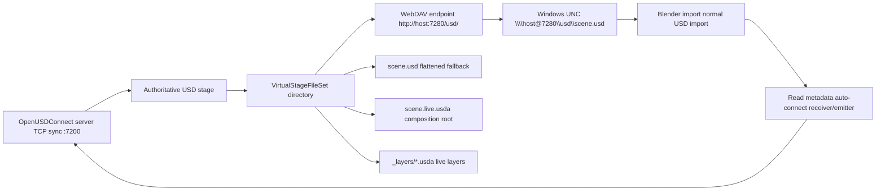

# Live-Open Production Guide

This document describes the current production shape of OpenUSDConnect
live-open: WebDAV snapshot fallback and Blender metadata-driven auto-connect.

## Current Architecture



The live server remains the source of truth. The virtual directory contains a
flattened snapshot for universal fallback, a composition-aware root for
UNC and inspection workflows, exported live layer files, and enough metadata
for integrated DCCs to connect to the direct TCP sync protocol.

## Prerequisites

Server:

- Python environment with OpenUSD `pxr` bindings available.
- `uv sync --group server --group vfs`, or equivalent packages installed.
- Reachable TCP ports for both sync and VFS.

Blender:

- Current USD Connect addon zip built and installed.
- `live_discovery.py` included in the addon package.
- Windows WebClient available if artists will use UNC paths.

## Supported Paths

| Path form | Example | Best use |
| --- | --- | --- |
| HTTP/WebDAV | `http://127.0.0.1:7280/usd/scene.usd` | Browser/download clients and Blender live URL import. |
| Windows UNC | `\\127.0.0.1@7280\usd\scene.usd` | Normal Windows file picker flow. |

Additional VFS entries:

| Entry | Purpose |
| --- | --- |
| `scene.live.usda` | Composition root layering live overrides over the original base path when available. |
| `_layers/base.usda` | Export of the server root/base layer for inspection and composition-aware opens. |
| `_layers/server-edits.usda` | Shared live edit layer. |
| `_layers/dept-*.usda` | Department layers when department ordering is enabled. |
| `openusdconnect.json` | Manifest for launchers, diagnostics, and support tooling. |

Raw HTTP is the backing transport. Do not assume every USD application can
open HTTP directly through `Usd.Stage.Open`; use UNC for normal file-path
semantics on Windows.

## Snapshot Semantics

- The VFS share serves a small virtual directory per server process.
- `scene.usd` is flattened USDA text with a `.usd` file name.
- `scene.live.usda` is a lightweight composition root, not a flattened export.
- The server caches snapshots by `(epoch, seq)`.
- `ETag` is emitted as `"epoch-seq"`.
- `Cache-Control: no-cache` is emitted for `GET` and `HEAD`.
- `epoch` bumps on compaction, purge, and visible stage changes that do not
  naturally advance the event log sequence, such as layer mute/unmute,
  merge/delete, department priority changes, and proposal approval/rejection.
- The flattened fallback is prewarmed in the background by default; pass
  `--no-vfs-prewarm` to disable this.
- `snapshot_seq` is read before flattening, so it never overclaims the
  sequence covered by the snapshot token.

The snapshot can be slightly ahead of its `snapshot_seq` if a transaction
races into the flatten after the token is read. Receivers are expected to
start from `snapshot_seq + 1`; the event vocabulary is idempotent enough for
safe at-least-once application.

## WebDAV Behavior

Supported operations:

| Method | Behavior |
| --- | --- |
| `GET` | Returns the current snapshot bytes. |
| `HEAD` | Returns current length, ETag, and no-cache headers. |
| `OPTIONS` | Advertises DAV class support for WebDAV clients. |
| `PROPFIND` | Lists the virtual share and file metadata. |
| `LOCK` / `UNLOCK` | Supported for Windows WebClient compatibility. |
| `PUT` to `scene.usd` | Forbidden by default; `drop` streams and discards the body; `translate` parses a full USD save and broadcasts translated live events. |

Forbidden operations:

- Create new files.
- Create directories.
- Delete the virtual file or share.
- Rename, move, or copy resources.

This is a deliberate safety policy. Direct file writes do not become live
events unless `--vfs-write-mode translate` is explicitly enabled; the default
is read-only behavior instead of silent success.

## File Picker UX

For artists, the preferred browseable path is a mounted WebDAV drive:

```powershell
uv run python scripts/mount_vfs_share.py --port 7280 --drive O: --open
```

The helper checks the VFS HTTP URL, tries to start the Windows WebClient
service, and maps the official HTTP WebDAV target first:

```text
net use O: http://127.0.0.1:7280/usd /persistent:no
```

If Windows reports `Access is denied` while starting WebClient, start the
service from an elevated PowerShell with `Start-Service WebClient`, or start
it from `services.msc`, then rerun the helper.

If WebClient is unavailable or blocked by policy, use the no-admin local
bridge:

```powershell
uv run python scripts/local_vfs_drive_bridge.py `
  --url http://127.0.0.1:7280/usd/scene.usd `
  --mount-dir .ouc_live_mount\usd `
  --drive O: `
  --force
```

This uses `subst`, so it does not require admin privileges. It gives artists
the same `O:\scene.usd` file-picker path and forwards local saves back to the
VFS write endpoint.

That maps:

```text
\\127.0.0.1@7280\usd
```

to:

```text
O:\
```

Users can then navigate to `O:\scene.usd` from normal Windows file pickers
without pasting a URL or UNC string. The helper can also unmount the drive:

```powershell
uv run python scripts/mount_vfs_share.py unmount --drive O:
```

## Blender UX

The current smooth path is:

1. User opens a normal-looking virtual USD file.
2. Blender imports the USD snapshot normally.
3. The addon reads `customLayerData["openusdconnect"]`.
4. If metadata is absent, the existing manual host/port workflow is used.
5. If metadata is present, the addon:
   - Sets receiver and emitter host/port from metadata.
   - Sets the base USD path to the imported snapshot.
   - Seeds receiver last sequence to `snapshot_seq`.
   - Starts the emitter.
   - Starts the receiver from `snapshot_seq + 1`.
6. If auto-connect fails, the imported snapshot remains open and the error
   is reported to the user.

This preserves backwards compatibility with the existing manual Blender
workflow.

HTTP live URL imports are downloaded to an ETag-keyed local cache. Unchanged
snapshots reuse the same local base file; a changed ETag creates a new cache
file and prunes the older file for that URL. If the URL points at
`scene.live.usda`, Blender follows the embedded `flattened_fallback` because a
single downloaded temp file cannot resolve the remote `_layers/` directory.

## Token And Security Model

The TCP sync server can require TOFU tokens with `--require-token`.
The WebDAV endpoint is currently anonymous.

Important consequences:

- `requires_token` in metadata means the TCP sync server requires a token.
- The token is never embedded in the USD file.
- Snapshot readers do not need a token.
- Live emit/receive clients must use the normal token handshake.
- A stale token causes authentication rejection; Blender deletes it and
  reports the failure.

Production deployments should treat the WebDAV snapshot as readable by
anyone who can reach the VFS host and port. For sensitive scenes, keep the
endpoint on localhost, put it behind trusted network controls, or add an
authenticated/TLS front door before exposing it beyond a workstation.

## Known Limitations

| Limitation | Impact | Production Direction |
| --- | --- | --- |
| Single scene share | One server exposes one scene directory, not a multi-scene project browser. | Add a scene/session registry above the current file set. |
| Composition root depends on base reachability | `scene.live.usda` uses the original base path when available; remote machines may not see it. | Add full virtual reference/layer remapping or package-like asset serving. |
| Full-file writes are coarse | `translate` handles complete USD snapshots, not semantic edit intent or conflict-aware merges. | Keep plugin/TCP sync as primary for interactive authoring; later add diff/merge policies. |
| Anonymous WebDAV | Snapshot can be read by reachable clients. | Bind locally by default; add TLS/auth or reverse proxy for LAN use. |
| Windows WebDAV differences | Some file dialogs and WebClient policies may reject custom ports. | Add workstation setup checks and optionally a mounted drive/helper app. |
| Snapshot flatten cost | Very large stages can make first flattened GET/import slow. | Prewarm is enabled; use `scene.live.usda`, benchmark real scenes, then add binary/range support if needed. |
| WebDAV no range support | Some large-file clients may be less efficient. | Add range support if a target DCC requires it. |

## Production Checklist

Before treating live-open as production ready for a show or team, verify:

- Server package installs `server` and `vfs` dependency groups.
- Server starts cleanly with `--vfs-port`.
- CLI logs show the expected HTTP and UNC paths.
- `--advertise-host` is correct for remote clients.
- Firewall rules allow both sync TCP and VFS ports.
- WebDAV/UNC opens from the target artist workstation.
- `scripts/check_windows_unc_webdav.py` succeeds on target Windows workstations.
- Blender addon package includes `live_discovery.py`.
- Blender can import the UNC path and auto-connect without manual host/port.
- Blender live URL import works for the HTTP URL.
- Token-required mode works on a fresh workstation and after token rotation.
- Non-integrated USD tools can open the snapshot read-only.
- Direct save attempts return read-only errors unless `--vfs-write-mode drop`
  or `--vfs-write-mode translate` is intentionally enabled and documented for
  that deployment.
- `python scripts/mount_vfs_share.py --port <port> --drive <letter> --open` exposes a
  browseable drive-letter path on target Windows workstations.
- `scripts/bench_vfs_snapshot.py --base <scene>` has acceptable cold/cached
  timings for representative production scenes.
- `tests/unit/test_vfs.py` passes.
- `tests/integration/test_vfs_webdav.py` passes.
- `OUC_RUN_UNC_SMOKE=1 tests/integration/test_windows_unc_webdav.py` passes on a configured Windows workstation.
- `tests/integration/test_live_discovery.py` passes.
- `tests/integration/test_live_open_blender.py` passes against supported Blender.
- Event logs are written to a known durable location.
- Backup/cleanup policy exists for event logs and generated snapshots.
- Operators know how to recover from compaction, purge, token rejection, and
  port conflicts.

## Recommended Production UX Next Steps

1. Add a launcher command that starts sync + VFS and prints/copies all open
   paths.
2. Add a read-only marker in Blender when the imported path is a VFS snapshot.
3. Add authenticated/TLS VFS serving before exposing snapshots outside trusted
   localhost or LAN environments.
4. Expand from one scene directory per server to a browsable multi-scene
   project namespace.
